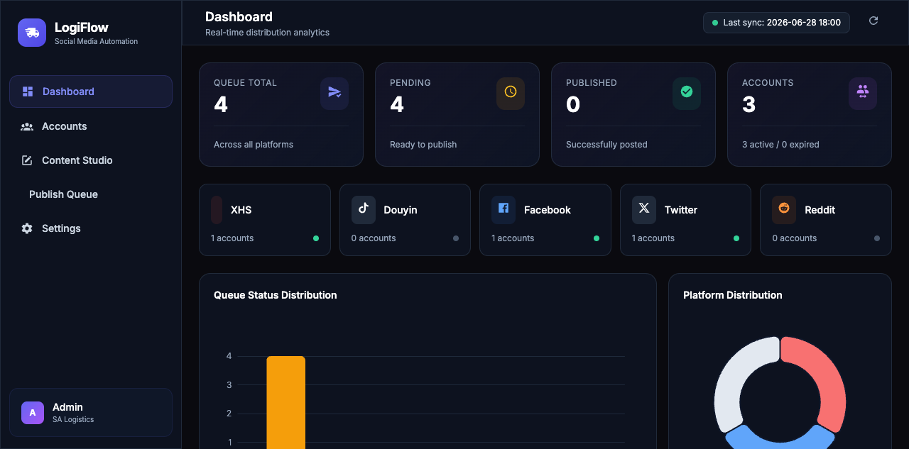
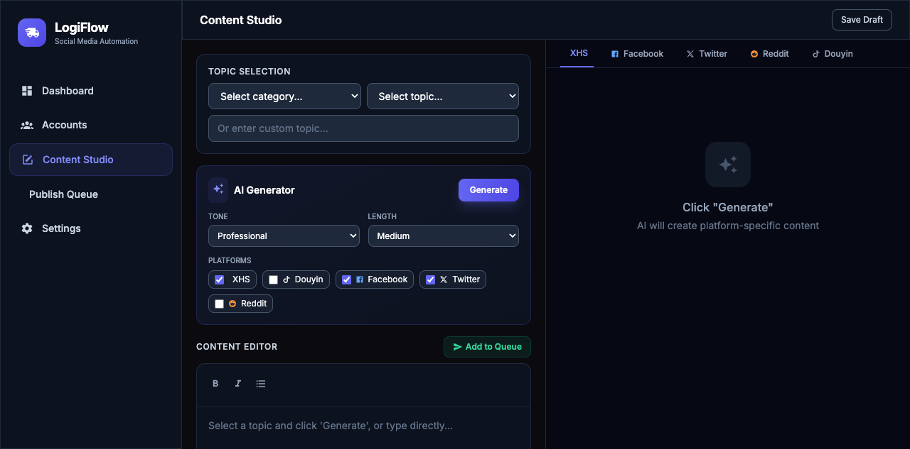
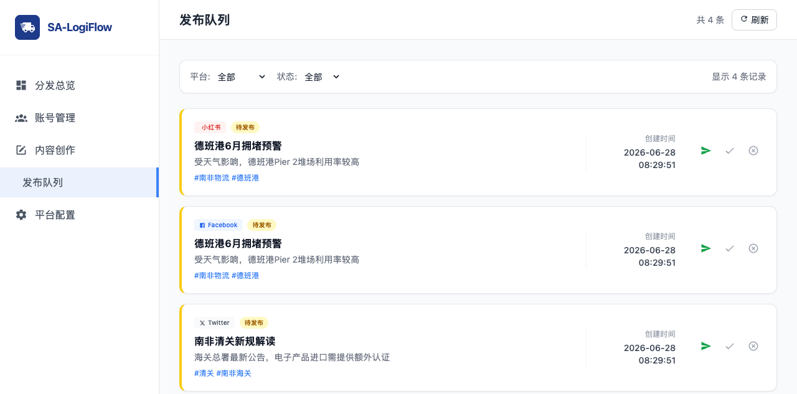
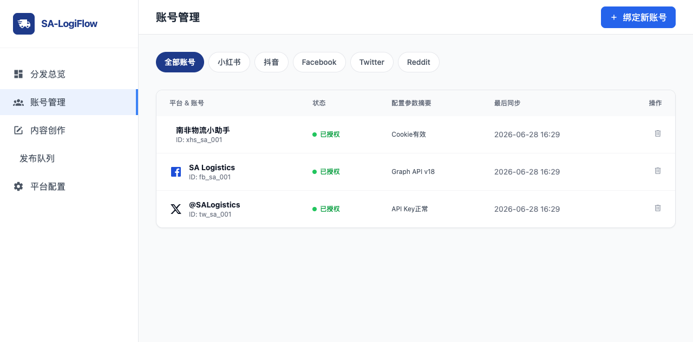
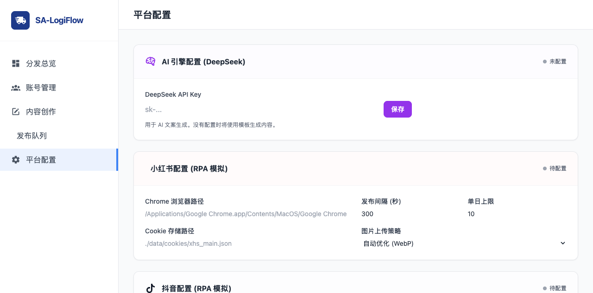

# SA-LogiFlow 功能介绍

## 项目概述

SA-LogiFlow 是一套面向南非物流行业的社交媒体自动化营销工具。通过 AI 内容生成和多平台自动发布，帮助物流公司实现从"人力密集型"到"系统驱动型"的营销转型。

---

## 核心功能模块

### 1. 分发总览（Dashboard）

实时掌握全局运营数据。



**功能亮点：**
- **数据卡片**：队列总数、待发布、已发布、绑定账号一目了然
- **平台状态面板**：小红书、抖音、Facebook、Twitter、Reddit 连接状态实时显示
- **可视化图表**：队列状态分布柱状图 + 平台分布饼图
- **最近活动**：最新发布记录，含时间、平台、标题、状态

---

### 2. 内容创作（Editor）

AI 驱动的一站式内容生产中心。



**功能亮点：**
- **6大物流主题库**：清关税务、港口运价、末端配送、避坑指南、成功案例、市场洞察，共 48 个细分话题
- **AI 文案生成器**：
  - 选择主题 → 选语气风格（专业/友好/紧急）→ 选文案长度（短/中/长）
  - 勾选目标平台，一键生成多平台定制内容
  - Xiaomi MiMo v2.5 API 驱动，生成专业内容并理解图片、视频与音频素材
- **多平台预览**：右侧实时预览小红书、Facebook、Twitter、Reddit、抖音的发布效果
- **一键入队**：编辑完成后直接加入发布队列

#### 视频精准匹配与内容资产

- **镜头级处理**：FFmpeg 在低分辨率代理流上检测场景，视频按 2–8 秒切分为可检索镜头，记录起止时间、缩略图、ASR 口播、OCR 字幕、主分类和多维标签。
- **证据优先分类**：人工确认 > 来源元数据 > OCR > ASR > 模型描述 > 文件名；低于阈值的结果显示“待复核”，不会伪装成确定分类。
- **口播精准匹配**：把口播或结构化分镜拆成语义片段，按语义、主体、场景/动作、情绪、业务作用、质量和时效综合评分。
- **硬约束与 Top 3**：地区或画幅冲突直接排除；每个语义片段展示最多 3 个候选、得分和真实匹配依据。
- **真实时间范围渲染**：人工确认后写回素材 ID、镜头 ID 与起止时间，成片渲染从相应时间点取画面，不再默认从整条视频开头取材。
- **素材/灵感隔离**：本地图片和视频可进入成片；官方新闻、YouTube、TikTok 等先进入团队灵感池。管理员登记授权名称、署名和证据链接并再次确认后，才允许下载成为本地素材。
- **桌面素材零复制接入**：管理员可把 `桌面/视频&图片素材` 中的图片和视频以硬链接方式接入素材库，不重复占用 5.9GB 磁盘空间；任务显示扫描、导入、去重、跳过、失败和分析排队数量，支持取消及断线提示。
- **内容资产职责收口**：页面只保留“本地素材”和“灵感链接”两个视图；高频动作是接入桌面素材与上传素材，分析存量素材和扫描项目导入目录收进“更多操作”。热点抓取、品牌证据与样本生成不再混入素材页。

#### 热点选题工作台

- **独立入口**：左侧“热点选题”进入 `http://localhost:8080/hotspots.html`，使用“热点池 + 选题工作区”的主从布局，不再依赖内容资产弹窗。
- **透明抓取状态**：每次抓取持久记录开始/结束时间、成功/部分失败/失败状态、新增、更新、跳过、许可配图与逐信源健康结果；离开页面后可继续查看结果。
- **可解释采集**：系统读取最多 5 个启用信源的公开 RSS / Atom，用固定关键词筛选南非物流条目，校验原文跳转域名并保存证据快照；抓取阶段不调用文本大模型。
- **开放许可边界**：官方热点正文作为事实来源保存；只有许可证明确的媒体自动落地。按主题找到的开放许可补充图会注明“并非事件现场”，避免误导。
- **南非热点信源边界**：最多同时启用 5 个 HTTPS 可信源；IOL 仅作为二级热点发现页保存，关键事实需回查官方机构或第二个独立来源，其图片、视频和全文不会自动进入素材库。
- **热点视频候选**：热点原文可发现 `og:video`、HTML 视频、JSON-LD `VideoObject` 和单条 YouTube 嵌入；也可人工绑定单条 YouTube、TikTok 或 HTTPS 视频直链。频道和播放列表不会直接下载，避免误抓整库。
- **正文图片与视频信源**：新闻原文会从文章主体发现普通图片并过滤 Logo、广告、头像，每篇最多 12 张；同时每六小时从 SA Today、South Africa Now、SABC Digital News 三个公开视频频道各读取最近 3 条单视频元数据，所有结果默认只作为黄色候选。
- **图片权利确认与入库**：热点图片与视频使用同一套“确认权利 → 下载并分析”入口。图片只允许 JPEG、PNG、WebP 且不超过 10MB；成功后复用现有素材分析，保留来源、许可证和署名。
- **双素材库成片**：热点库的视频只有完成权利证据与管理员确认后，才通过 `yt-dlp` 下载并复用现有 `ffmpeg/ffprobe` 分析链路进入匹配；热点钩子只匹配当前热点素材，品牌证明只匹配 Buffalo 自有素材，35 秒样本约为 31% 热点＋69% 自有素材。
- **成片前素材门禁**：样本仍可生成视频脚本、图文和公众号内容；如果当前热点没有已处理媒体，或原本库没有品牌镜头，视频会标记为“暂不可成片”并列出具体缺口，不展示虚假的 MP4 就绪状态。
- **样本优先证据 Harness（方案 B）**：从一条官方热点建立事实 claim，再与经过人工确认、允许公开使用的 Buffalo 品牌证据组合；同一个证据包一次生成视频脚本、6 页图文和 800–1200 字公众号软文，三种内容共享 claim ID 和来源 URL，但使用不同结构。
- **热点专题包工作台**：热点页按真实事件聚合多个来源信号，左侧按热度、事件类型和素材形式筛选专题包，右侧展示事件摘要、信号时间线、视频/图片/纯文本、权利汇总和物流角度。
- **确认与出库边界**：确认专题包只改变专题包状态，不会批量下载外部媒体；只有管理员对单个媒体执行“准备分析”且权利状态允许时，才进入下载、抽帧、转写和事件切片流程。
- **视频跟进边界**：专题包进入视频跟进后，只选择该专题包已分析的热点事件片段，并与 Buffalo 自有动态视频编排为 60 秒证据计划；媒体或证据不足时阻止生成。
- **内部样本门禁**：没有品牌证据时自动删掉时效、覆盖率和业绩承诺；镜头不足或候选低于质量门槛时逐项标为“需人工换镜头”。内部预览始终显示“内部测试，不可发布”，并保持 `publish_allowed=false`，不会进入发布队列。
- **本地低成本视频预览**：内部样本可使用 macOS 系统语音和 FFmpeg 离线合成，不把 Buffalo 文案发送给外部 TTS；只有明确配置并授权后才使用远程语音服务。
- **可替换模型角色**：在设置页分别配置 `planner_text`、`vision_tagger`、`critic`、`tts`，更换 OpenAI-compatible 模型无需改业务代码。数据库只保存 Key 的环境变量名；单个样本默认最多 4 次远程调用，并记录 Token、估算成本和缓存命中。

**AI 生成示例：**

> **小红书**（中文种草风格）：
> 📦 德班港拥堵警报！数据揭示最新危机🚨
> 最新数据显示，德班港船舶平均等待时间已延长至7-10天...

> **Facebook**（英文 B2B 分析）：
> 🚢 Durban Port Congestion Alert: Supply Chain Bottleneck Returns?
> South African logistics professionals, please note...

> **Twitter**（精炼推文）：
> 🚨 Durban port container dwell time hits 72hrs, +25% MoM. Carriers charging $500/TEU congestion surcharge...

---

### 3. 发布队列（Queue）

管理所有待发布内容，支持筛选和操作。



**功能亮点：**
- **筛选功能**：按平台（小红书/抖音/Facebook/Twitter/Reddit）和状态（待发布/审核中/已发布/失败）筛选
- **队列卡片**：每条内容展示平台标签、状态标签、标题、正文预览、标签、创建时间
- **操作按钮**：
  - 🟢 **发布**：通过慧媒 CLI 自动发布到对应平台
  - ✅ **标记已发布**：手动标记发布完成
  - ❌ **删除**：从队列移除

---

### 4. 账号管理（Accounts）

集中管理所有社媒平台账号。



**功能亮点：**
- **平台筛选**：一键筛选查看各平台账号
- **账号表格**：展示平台、账号名称、ID、状态、配置摘要、最后同步时间
- **新增账号**：点击「绑定新账号」弹窗填写平台、名称、ID、配置信息
- **删除账号**：支持删除已绑定账号

---

### 5. 平台配置（Config）

配置各平台接入参数和 AI 引擎。



**功能亮点：**

#### AI 引擎配置
- Xiaomi MiMo API Key 配置
- 配置后启用真 AI 内容生成，未配置时使用模板生成

#### 小红书配置（RPA 模拟）
- Chrome 浏览器路径
- Cookie 存储路径
- 发布间隔（秒）
- 单日发布上限
- 图片上传策略（原始/WebP优化/水印）

#### 抖音配置（RPA 模拟）
- Chrome 浏览器路径
- Cookie 存储路径
- 发布间隔
- 单日上限
- 视频时长限制

#### Facebook 配置（Graph API）
- Page ID
- Access Token
- API 版本
- App Secret

#### Twitter/X 配置（API v2）
- API Key / API Secret
- Access Token / Access Token Secret

#### Reddit 配置（PRAW）
- Client ID / Client Secret
- User Agent
- 目标 Subreddits

---

## 技术架构

```
┌─────────────────────────────────────────────────────┐
│                    前端 (HTML)                        │
│   Dashboard │ Editor │ Queue │ Accounts │ Config      │
└───────────────────────┬─────────────────────────────┘
                        │ REST API
┌───────────────────────┴─────────────────────────────┐
│                 后端 (FastAPI)                        │
│  ┌──────────┐ ┌──────────┐ ┌───────────┐            │
│  │ AI Engine │ │ Publisher│ │ Database  │            │
│  │ (MiMo 2.5)│ │ (慧媒)   │ │ (SQLite)  │            │
│  └──────────┘ └──────────┘ └───────────┘            │
└─────────────────────────────────────────────────────┘
```

---

## 支持平台

| 平台 | 发布方式 | 内容类型 | 状态 |
|------|---------|---------|------|
| 小红书 | 慧媒 CLI | 图文 | ✅ |
| 抖音 | 慧媒 CLI | 图文/视频 | ✅ |
| TikTok | 慧媒 CLI | 视频 | ✅ |
| B站 | 慧媒 CLI | 视频/图文 | ✅ |
| 微博 | 慧媒 CLI | 图文/视频 | ✅ |
| Facebook | Graph API | 图文 | 待接入 |
| Twitter/X | API v2 | 推文 | 待接入 |
| Reddit | PRAW | 帖子 | 待接入 |

---

## 效率提升数据

| 指标 | 人工操作 | 工具辅助 | 提升倍数 |
|------|---------|---------|---------|
| 单篇内容耗时 | 1-2 小时 | 2-3 分钟 | 30-40x |
| 每周产出量 | 3-5 篇 | 30-50 篇 | 10x |
| 平台覆盖数 | 1-2 个 | 5+ 个 | 3-5x |
| 每周触达人数 | 50-100 | 500-1000+ | 10x |
| 月均询盘数 | 2-3 个 | 15-20 个 | 5-7x |
| 运营人力投入 | 15-20h/周 | 2-3h/周 | 节省 85% |

---

## 快速开始

```bash
# 1. 克隆项目
git clone https://github.com/klpping512/distribution-manager.git
cd distribution-manager

# 2. 安装依赖
pip install -r requirements.txt
pip install huimei

# 可选：安装本地场景检测、ASR、OCR 和授权下载能力
pip3 install -i https://pypi.tuna.tsinghua.edu.cn/simple -r requirements-media-ai.txt

# 可选：下载本地多语言 ASR 模型；下载成功后 start.sh 会自动识别
python3 scripts/download_asr_model.py

# 3. 配置 API Key
export MIMO_API_KEY=your_api_key

# 4. 启动服务
python3 app.py
```

访问 http://localhost:8080 即可使用。

---

## 项目链接

- **GitHub**: https://github.com/klpping512/distribution-manager
- **慧媒官网**: https://huimei.smaroot.tech
## AI 对话到高质量视频生成（2026-07-21）

AI 对话中的抖音脚本现已接入持久、可取消、可恢复的视频项目工作流。系统在脚本、素材匹配、低清预览和高清成片四个关键节点执行质量检查；只有全部通过才输出最终 MP4，质量不足会停在问题清单，不再静默生成低质量成片。

主要能力：

- AI 对话一键创建视频项目并启动生成；
- 服务端持久任务，刷新或跳页不丢失；
- 同一修订幂等生成，重复点击不重复排队；
- 全局任务中心显示阶段、进度、待确认和取消入口；
- 取消请求可终止活动 FFmpeg 进程；
- 视频项目页统一编辑旁白、分镜、音色和问题清单；
- 内容编辑器、视频精准匹配通过 `project_id` 读写同一项目修订；
- 匹配质量不足时明确停在“等待人工处理”，显示分数和问题，不再把质量门禁误显示为卡死；连续三次读取失败则提示重启本地 8080 服务；
- 视频精准匹配不占用左侧主导航，仅在视频项目需要人工处理素材问题时提供入口；
- 素材严格按开始/结束边界取镜头，横屏转竖屏降权复核；
- 540×960 预览通过后再生成 1080×1920 高清成片。

详细操作参见 `docs/AI视频一键生成与质量门禁操作说明.md`。
